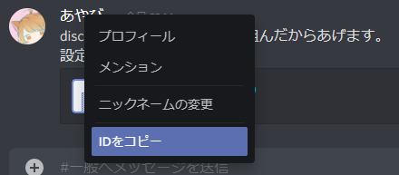
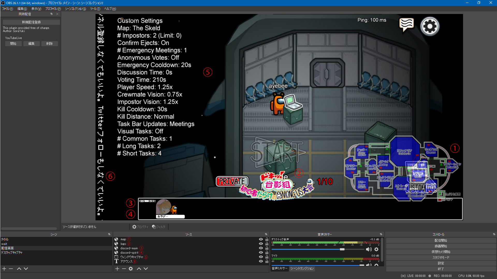

# CSSの編集の仕方

## 内容物

<dl>
<dt>README.md
<dd>このファイルです。
<dt>discord-main.css
<dd>Discord オーバーレイのブラウザソース用の CSS です。<br>
    適用すると、ボイスチャットの参加メンバーを横一列に表示します。<br>
    メンバー別設定部分と、お好みでルーム別設定部分を編集し、 Discord オーバーレイのURLを指定したブラウザソースの CSS 欄に張り付けて使用します。
<dt>discord-spirit.css
<dd>上記同様、 Discord オーバーレイのブラウザソース用の CSS です。<br>
    こちらは霊界チャット用のブラウザソースに使用する CSS になります。
<dt>images/
<dd><dl>
    <dt>amongus-map.ai
    <dd>The Skeld のマップです。<br>
        サイズは1920x1080、Adobe Illustrator形式です。
    <dt>amongus-map.svg
    <dd>The Skeld のマップです。<br>
        サイズは1920x1080、ベクター形式です。<br>
        OBSで使用する場合はブラウザソースのローカルファイルとして指定することで表示可能です。
    <dt>amongus-map.png
    <dd>The Skeld のマップです。<br>
        サイズは1920x1080、PNG形式です。
    <dt>amongus-map-s.ai
    <dd>The Skeld のマップです。<br>
        サイズは311x120です。<br>
        再編集可能なAdobe Illustrator形式です。
    <dt>amongus-map-s-blue.svg
    <dd>The Skeld のマップです。<br>
        サイズは311x120、ベクター形式です。<br>
        OBSで使用する場合はブラウザソースのローカルファイルとして指定することで表示可能です。
    <dt>amongus-map-s-blue.png
    <dd>The Skeld のマップです。<br>
        サイズは311x120、PNG形式です。
    <dt>amongus-map-s-red.svg
    <dd>The Skeld のマップです。<br>
        サイズは311x120、ベクター形式です。<br>
        OBSで使用する場合はブラウザソースのローカルファイルとして指定することで表示可能です。<br>
        赤を基調とした色になってます。
    <dt>amongus-map-s-red.png
    <dd>The Skeld のマップです。<br>
        サイズは311x120、PNG形式です。<br>
        赤を基調とした色になってます。
    <dt>amongus-map-s-red.svg
    <dd>The Skeld のマップです。<br>
        サイズは311x120、ベクター形式です。<br>
        OBSで使用する場合はブラウザソースのローカルファイルとして指定することで表示可能です。<br>
        緑を基調とした色になってます。
    <dt>amongus-map-s-green.png
    <dd>The Skeld のマップです。<br>
        サイズは311x120、PNG形式です。<br>
        緑を基調とした色になってます。
    <dt>
</dl>
</dl>

## CSSファイルの編集方法

1. お好みのテキストエディタで開きます。（メモ帳とか、VSCodeとか。）
1. 最下部の ``/* メンバー別設定 */`` と書かれたところまでスクロールします。  
    * ワンポイント 💡  
      脱線して CSS の基礎知識になりますが、 `/*` と `*/` で囲まれた部分を「コメント」と言います。  
      コメントは設定内容に影響を与えず、メモ書きが出来るものです。  
      また、 CSS は以下のような構文で、見た目を指定します。
        ``` CSS
        <設定対象> {
            見た目の項目名: 見た目の設定値;
        }
        ```
      `{}` でくくられた部分の設定内容が、 <設定対象> の見た目に影響を与えます。
1. メンバー別設定は初期状態では以下のように記載されています：
    ``` CSS
    /* メンバー別設定 */
    /* プレイヤー1(自分) */
    li.voice-state[data-reactid*="（ここにDiscordでコピーしたIDを張り付ける）"] {
        --player-icon: var(--player-orange);
        /*display: none;*/ /* 自分を非表示にしたい時はコメントアウト外す */
    }
    /* プレイヤー2 */
    li.voice-state[data-reactid*="（ここにDiscordでコピーしたIDを張り付ける）"] {
        --player-icon: var(--player-brown);
    }
    /* プレイヤー3 */
    li.voice-state[data-reactid*="（ここにDiscordでコピーしたIDを張り付ける）"] {
        --player-icon: var(--player-yellow);
    }
    /* プレイヤー4 */
    li.voice-state[data-reactid*="（ここにDiscordでコピーしたIDを張り付ける）"] {
        --player-icon: var(--player-green);
    }
    /* 以降、プレイヤー人数分追加する */
    ```
1. 表示するプレイヤーの人数分、行をコピペして増やします。<br>
   また、参加者のプレイヤーカラーと、 Discord の ID を調べて、上書きしていきます。<br>
   使える色は <span style="font-weight:bold"><span style="color:#760b39">red</span>, <span style="color:#070a93">blue</span>, <span style="color:#134d28">green</span>, <span style="color:#a728b3">pink</span>, <span style="color:#b14100">orange</span>, <span style="color:#c08822">yellow</span>, <span style="color:#141414">black</span>, <span style="color:#8393c1">white</span>, <span style="color:#3c177c">purple</span>, <span style="color:#5e2614">brown</span>, <span style="color:#34a7bf">cyan</span>, <span style="color:#2da82a">lime</span></span> の12色です。<br>
   IDはDiscord上で対象のユーザーの名前を右クリックして、「IDをコピー」をクリックすれば取得できます。<br>
   <br>
   コメント部にプレイヤー名を付記しておくとわかりやすいでしょう。<br>
   例えば10人の場合：
    ``` CSS
    /* メンバー別設定 */
    /* プレイヤー1(自分) */
    li.voice-state[data-reactid*="062862089986280348"] {
        --player-icon: var(--player-orange);
        /*display: none;*/ /* 自分を非表示にしたい時はコメントアウト外す */
    }
    /* プレイヤー2(山田さん) */
    li.voice-state[data-reactid*="141592653589793238"] {
        --player-icon: var(--player-brown);
    }
    /* プレイヤー3(島田さん) */
    li.voice-state[data-reactid*="264338327950288419"] {
        --player-icon: var(--player-yellow);
    }
    /* プレイヤー4(上田さん) */
    li.voice-state[data-reactid*="342117067982148086"] {
        --player-icon: var(--player-green);
    }
    /* プレイヤー5(町田さん) */
    li.voice-state[data-reactid*="481117450284102701"] {
        --player-icon: var(--player-red);
    }
    /* プレイヤー6(蒲田さん) */
    li.voice-state[data-reactid*="502884197169399375"] {
        --player-icon: var(--player-blue);
    }
    /* プレイヤー7(林田さん) */
    li.voice-state[data-reactid*="644622948954930381"] {
        --player-icon: var(--player-pink);
    }
    /* プレイヤー8(森田さん) */
    li.voice-state[data-reactid*="724587006606315588"] {
        --player-icon: var(--player-orange);
    }
    /* プレイヤー9(高田さん) */
    li.voice-state[data-reactid*="862803482534211706"] {
        --player-icon: var(--player-black);
    }
    /* プレイヤー10(橋田さん) */
    li.voice-state[data-reactid*="962829254091715364"] {
        --player-icon: var(--player-white);
    }
    ```
1. 例えば自分自身は別途立ち絵や Live2D を表示するので一覧には表示したくない場合、プレイヤー1(自分)の内容を編集します。  
    **変更前**
    ``` CSS
    /* プレイヤー1(自分) */
    li.voice-state[data-reactid*="062862089986280348"] {
        --player-icon: var(--player-orange);
        /*display: none;*/ /* 自分を非表示にしたい時はコメントアウト外す */
    }
    ```
    **変更後**
    ``` CSS
    /* プレイヤー1(自分) */
    li.voice-state[data-reactid*="062862089986280348"] {
        --player-icon: var(--player-orange);
        display: none; /* 自分を非表示にしたい時はコメントアウト外す */
    }
    ```
1. 他にも、ボイスチャットにはいるけど表示したくない人物がいる場合は、以下のように追記すれば非表示にできます。
    ``` CSS
    /* 非表示参加者 */
    li.voice-state[data-reactid*="(対象のユーザーのID)"] {
        display: none;
    }
    ```
    複数人いる場合は以下のようにカンマ区切りで記載していきます:
    ``` CSS
    /* 非表示参加者 */
    li.voice-state[data-reactid*="(対象のユーザー1のID)"],
    li.voice-state[data-reactid*="(対象のユーザー2のID)"],
    li.voice-state[data-reactid*="(対象のユーザー3のID)"] {
        display: none;
    }
    ```
1. ここではそれ以外の CSS の編集方法については割愛しますが、 CSS の知識があれば、お好みで見た目を変えることもできます。
1. 編集が終わったら、 OBS にブラウザソースを作成し、各種設定を以下のようにします。
    項目|設定
    :---|:---
    ローカルファイル|OFF
    URL|Discord オーバーレイの URL
    幅|1800 (それ以下でも可能ですが、はみ出さないように調整してください。)
    高さ|120 (この値は固定です。)
    カスタムフレームレートを使用|OFF
    OBSを介して音声を制御する|OFF
    カスタム CSS|上記で編集した CSS (元の記載を削除して、上書き)
    表示されていないときにソースをシャットダウン|OFF
    シーンがアクティブになったときにブラウザの表示を更新|ON
1. 霊界チャットも表示したい場合は、 _discord-main.css_ と同様に、 _discord-spirit.css_ の編集とブラウザソースの配置を行います。  
   霊界チャット用のブラウザソースは、幅・高さを一般ボイチャ用に合わせ、ぴったり重なるように配置すると、一般は左寄せ、霊界は右寄せで一列に表示できます。

## 配置例



③ / ④ がそれぞれメインチャット用ブラウザソース(discord-main) / 霊界チャット用ブラウザソース(discord-spirit) となっています。

以上で、設定は終わりです。